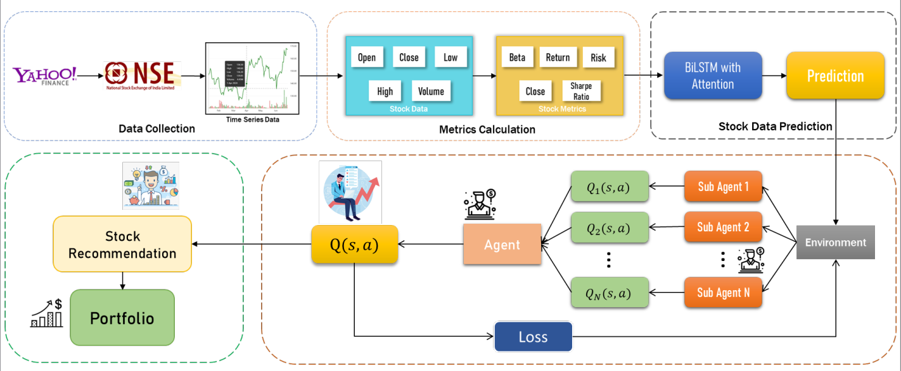
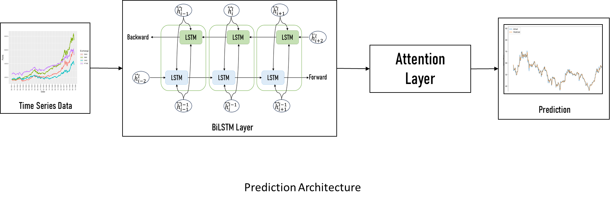
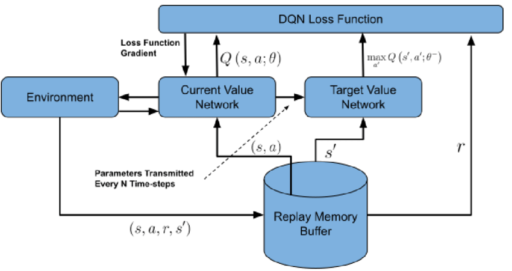

# Leveraging the Potential of Attention Network with Reinforcement Learning for Stock Portfolio Recommendation: A Collaborative Agent System

## Overview

This repository presents an advanced, collaborative agent-based system for stock portfolio recommendation. By integrating Deep Q-Networks (DQN), Bi-directional LSTM with Self-Attention, and multi-agent reinforcement learning, the system delivers personalized, risk-aware portfolio suggestions tailored to diverse investor profiles. The approach outperforms traditional models in both risk-adjusted returns and adaptability to market dynamics.

## Table of Contents

- [Key Features](#key-features)
- [System Architecture](#system-architecture)
- [Data Pipeline](#data-pipeline)
- [Deep Learning Prediction](#deep-learning-prediction)
- [Collaborative Agent Model](#collaborative-agent-model)
- [Evaluation and Results](#evaluation-and-results)
- [Getting Started](#getting-started)
- [Authors](#authors)
- [License](#license)

## Key Features

- **Collaborative Multi-Agent DQN:** Each agent specializes in a specific investor profile (e.g., institutional, middle-class), with a final agent aggregating recommendations.
- **Bi-LSTM with Self-Attention:** Captures complex temporal and latent patterns in stock data for accurate forecasting.
- **Risk-Aware Portfolio Construction:** Customizes portfolios using metrics like Sharpe Ratio, Beta, and Cumulative Returns.
- **Dynamic Learning:** Agents adapt to evolving market trends and investor needs.
- **Real-World Data:** Utilizes 13 years of NSE stock data for robust model training and evaluation.

## System Architecture

*Figure 1: Collaborative Agent-based Stock Portfolio Recommendation System*

- **Sub-Agents:** Each handles a specific risk profile or investor type.
- **Final Agent:** Aggregates sub-agent outputs to recommend an optimal portfolio.
- **Reinforcement Learning Environment:** Simulates market dynamics and investor behavior, enabling agents to learn and adapt.

## Data Pipeline

- **Data Source:** 13 years of historical stock data from the National Stock Exchange (NSE) via yfinance.
- **Features:** Open, Close, High, Low, Volume.
- **Preprocessing:** Min-max scaling and log transformation to normalize features and stabilize variance.

## Deep Learning Prediction

*Figure 2: Attention-enabled Bi-directional LSTM Model for Stock Prediction*

- **Bi-LSTM:** Processes input sequences in both forward and backward directions to capture comprehensive trends.
- **Self-Attention:** Focuses on important time steps and features, enhancing prediction during volatile periods.
- **Output:** 3-year stock price forecasts used for portfolio construction.

## Collaborative Agent Model

*Figure 3: Deep Q-Network Agent Decision Flow*

- **State:** Market data (historical prices, technical indicators, calculated metrics).
- **Action:** Buy, sell, hold, or allocate resources.
- **Reward:** Reflects profit and risk trade-off, guiding agents to optimize long-term returns.
- **Experience Replay & Target Network:** Improve learning stability and efficiency.

## Evaluation and Results

### Stock Prediction Performance

| Model                   | MSE   | MAE   | MAPE  |
|-------------------------|-------|-------|-------|
| LSTM                    | 4.321 | 1.876 | 3.120 |
| Bi-LSTM                 | 3.112 | 1.432 | 2.671 |
| **Bi-LSTM + Attention** | 2.424 | 1.014 | 1.883 |

*The Bi-LSTM with Attention outperforms other models in all error metrics.*

### Portfolio Recommendation Performance

| Investor Type         | Cumulative Return | Risk Allocation (Low/Med/High) | Sharpe Ratio | Beta  |
|-----------------------|------------------|-------------------------------|--------------|-------|
| Institutional         | 71.99%           | 0% / 20% / 80%                | High         | 1.237 |
| Middle-Class (500k)   | 59.38%           | 30% / 50% / 20%               | Moderate     | 1.1   |
| Middle-Class (50k)    | 41.84%           | 80% / 0% / 20%                | Low          | 0.8   |

## Authors

- Sri Sethu Madhavan S (Department of CSE, Srinivasa Ramanujan Centre, SASTRA Deemed University, India)
- Harshavardhan M V (Department of CSE, Srinivasa Ramanujan Centre, SASTRA Deemed University, India)
- Bhuvaneswari Swaminathan (Department of CSE, Srinivasa Ramanujan Centre, SASTRA Deemed University, India) 

*Keywords: Reinforcement Learning, Deep Q-Network, Bi-LSTM, Attention Mechanism, Stock Market, Portfolio Recommendation, Multi-Agent Systems*

